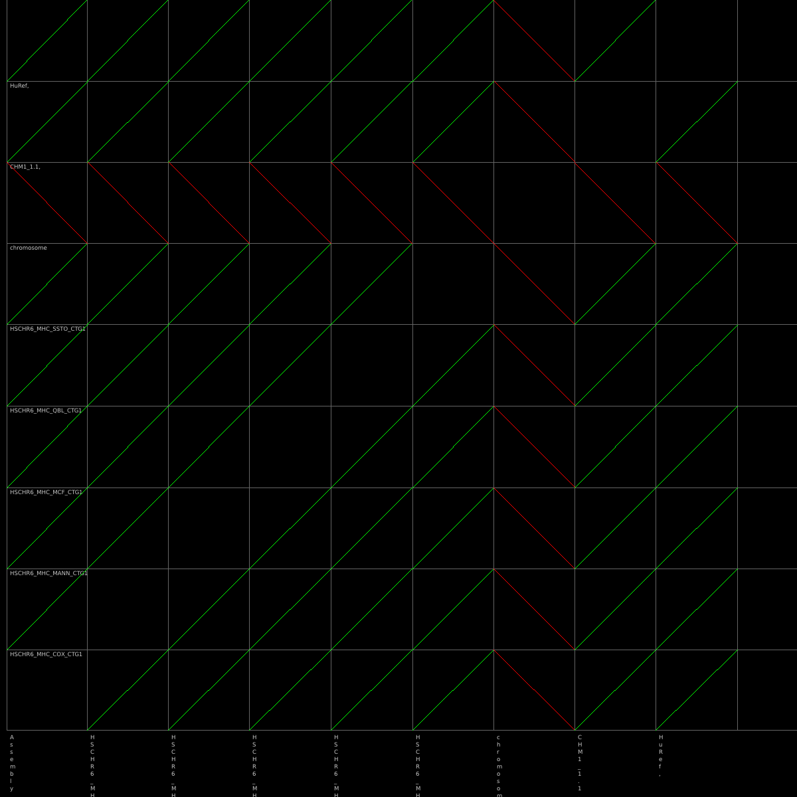

# alnviz

A fast, interactive alignment viewer for pangenome analysis.


## Overview

**alnviz** is a pure Rust implementation of an alignment visualization tool, built on the design of Gene Myers' [ALNVIEW](https://github.com/thegenemyers/ALNVIEW). It provides fast, interactive exploration of genome-to-genome alignments produced by [FASTGA](https://github.com/thegenemyers/FASTGA).


*Example alignment plot showing forward alignments (green) and reverse complement alignments (red). Distinctive inversion patterns are clearly visible.*

### Key Features

- 🦀 **Pure Rust** - No C dependencies, fast compilation, memory safe
- 🎯 **Interactive Exploration** - Zoom, pan, and explore alignments in real-time
- 🚀 **Fast Loading** - Efficient R\*-tree spatial indexing for large genomes
- 🎨 **Clean Visualization** - Forward (green) and reverse complement (red) alignments
- 📊 **Multiple Views** - Support for filtering by sequence names, prefixes, or ranges
- 🖼️ **PNG Export** - Generate publication-quality alignment plots from command line

## Installation

### From Source

```bash
git clone https://github.com/pangenome/alnviz.git
cd alnviz
cargo build --release
```

The binary will be available at `target/release/alnview`.

### Requirements

- Rust 1.70+ (install via [rustup](https://rustup.rs/))
- On Linux: X11 development libraries
  ```bash
  sudo apt-get install libxcb-render0-dev libxcb-shape0-dev libxcb-xfixes0-dev libxkbcommon-dev libssl-dev
  ```

## Usage

### GUI Mode (Interactive)

```bash
# Open GUI and select file
alnview

# Load file at startup
alnview alignment.1aln
```

**Controls:**
- 🖱️ **Left-click drag**: Pan the view
- 🎯 **Scroll wheel**: Zoom in/out at mouse position
- ⇧ **Shift + drag**: Box zoom to selected region
- ⌨️ **Z key**: Undo last zoom (go back)
- **Hover**: Show sequence names and positions

### Command Line Mode

**Print alignment statistics:**
```bash
alnview alignment.1aln --stats
```

**Generate PNG plot:**
```bash
alnview alignment.1aln --plot output.png
```

**Filter by sequence:**
```bash
# By name or prefix
alnview alignment.1aln --plot filtered.png \
  --query-filter "chr1,chr2" \
  --target-filter "scaffold"

# By index range
alnview alignment.1aln --plot subset.png \
  --query-range "0-5" \
  --target-range "10-20"
```

## Input Format

alnviz reads `.1aln` files produced by [FASTGA](https://github.com/thegenemyers/FASTGA)'s alignment pipeline. These files contain:
- Pairwise alignment coordinates
- Sequence identifiers and names
- Alignment quality metrics

### TODO: PAF Support

Direct PAF input is planned using `fastga-rs` conversion:
```bash
# Planned feature - convert PAF to .1aln on-the-fly
alnview --from-paf alignment.paf
```

This will use the `fastga-rs` library to convert PAF format alignments to temporary .1aln files for visualization.

## Technical Details

### Architecture

- **GUI Framework**: [egui](https://github.com/emilk/egui) - Immediate mode GUI
- **Alignment Reader**: [fastga-rs](https://github.com/pangenome/fastga-rs) - Pure Rust .1aln parser
- **Spatial Indexing**: R\*-tree for efficient viewport queries
- **Async Loading**: Background threads for large file loading

### Performance

- Loads multi-gigabase genomes in seconds
- Interactive zoom/pan at 60 FPS
- Memory-efficient streaming of alignment records

## Development

### Building

```bash
# Debug build
cargo build

# Release build (optimized)
cargo build --release

# Run tests
cargo test

# Run with logging
RUST_LOG=debug cargo run alignment.1aln
```

### Testing

```bash
# Unit tests
cargo test --lib

# Golden file tests (requires test.1aln)
cargo test --test golden_tests
```

### Code Structure

```
src/
├── main.rs              # GUI application and CLI
├── rust_plot.rs         # Plot data structures and filtering
├── aln_reader.rs        # .1aln file parsing
├── sequence_filter.rs   # Sequence filtering logic
└── ffi.rs              # Legacy FFI (unused, kept for reference)
```

## Acknowledgments

This implementation is built on the design of **Gene Myers'** [ALNVIEW](https://github.com/thegenemyers/ALNVIEW), originally written in C with Qt. The visualization algorithms, coordinate transformations, and UI interactions follow Gene's original design.

**Key innovations from the original ALNVIEW:**
- Efficient quad-tree spatial indexing for large genome alignments
- Coordinate mapping for scaffolded genome visualization
- Reverse complement alignment rendering
- Interactive zoom and pan controls

**From Gene Myers' original ALNVIEW README:**
> ALNview allows you to view the alignments in a .1aln as a "dot" plot between the two source
> genomes, where each alignment is viewed as a line segment.

This Rust reimplementation maintains the core visualization approach while modernizing the technology stack for better portability and performance.

## Citation

If you use alnviz in your research, please cite:

```bibtex
@software{alnviz2025,
  title = {alnviz: Interactive Alignment Viewer for Pangenome Analysis},
  year = {2025},
  note = {Built on the design of ALNVIEW by Gene Myers},
  url = {https://github.com/pangenome/alnviz}
}
```

Original ALNVIEW by Gene Myers:
```bibtex
@software{myers2023alnview,
  title = {ALNVIEW: Alignment Visualization Tool},
  author = {Myers, Gene},
  year = {2023},
  url = {https://github.com/thegenemyers/ALNVIEW}
}
```

## License

MIT License - See LICENSE file for details

## Contributing

Contributions welcome! Please:
1. Fork the repository
2. Create a feature branch
3. Make your changes with tests
4. Ensure `cargo fmt` and `cargo clippy` pass
5. Submit a pull request

## Related Tools

- [FASTGA](https://github.com/thegenemyers/FASTGA) - Fast genome alignment tool
- [fastga-rs](https://github.com/pangenome/fastga-rs) - Rust library for FASTGA formats
- [ALNVIEW](https://github.com/thegenemyers/ALNVIEW) - Original C/Qt implementation

## Support

- 🐛 **Issues**: https://github.com/pangenome/alnviz/issues
- 💬 **Discussions**: https://github.com/pangenome/alnviz/discussions
